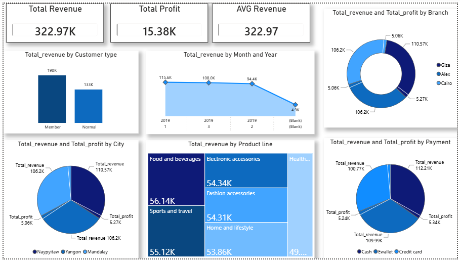

# Supermarket Sales Analysis

End-to-end data analysis project on a supermarket sales dataset — data profiling, cleaning, and business-question analysis in Python (Pandas), plus a Power BI dashboard.

## 📁 Project Structure

```
├── data/
│   ├── supermarket_raw.csv        # Original, uncleaned dataset
│   └── supermarket_cleaned.csv    # Cleaned dataset (output of the notebook)
├── notebooks/
│   └── supermarket_analysis.ipynb # Data profiling, cleaning, and analysis
├── dashboard/
│   ├── SuperMarket_Analysis.pbix  # Power BI dashboard file
│   └── dashboard_screenshot.png   # Dashboard preview image
└── README.md
```

## 📊 Dashboard Preview



Open `dashboard/SuperMarket_Analysis.pbix` in Power BI Desktop to explore it interactively.

## 🧹 Data Cleaning (Notebook)

- Removed duplicate rows
- Converted `Date` to datetime and `Sales` to numeric
- Filled missing `Sales` values using `Unit price × Quantity + Tax`
- Filled missing `Unit price` values by back-calculating from `Sales` and `Tax`
- Extracted `Day`, `Month`, `Year` from `Date`
- Standardized inconsistent `Branch` labels (e.g. "giza" → "Giza")
- Added a `Satisfaction` column: `Rating >= 7` → "Satisfied", else "Not Satisfied"

## 📈 Business Questions Answered

1. Total revenue generated by the supermarket
2. Total revenue by city, and the top city
3. Total profit by branch, and the most profitable branch
4. Total revenue and profit by product category, and the top category
5. Total spending by customer type, and which type spends more
6. Transaction count by payment method, and the most popular method
7. Average transaction value
8. Customer satisfaction percentage by branch, and the highest-satisfaction branch
9. Total revenue by day and month, and the highest-selling day/month
10. Overall percentage of satisfied customers/transactions

## 🔑 Key Findings

- **Total Revenue:** ~322.97K | **Total Profit:** ~15.38K | **Avg Revenue:** ~322.97
- **Top branch by revenue/profit:** Giza
- **Top city:** Cairo (Total_revenue ~110.57K)
- **Top product line:** Food and beverages (~56.14K)
- **Customer type:** Members spend more than Normal customers (~190K vs ~133K)
- **Top payment method:** Cash

## 🛠️ Tools Used

- Python (Pandas)
- Jupyter Notebook
- Power BI

## 🚀 How to Run

```bash
pip install pandas jupyter
jupyter notebook notebooks/supermarket_analysis.ipynb
```
